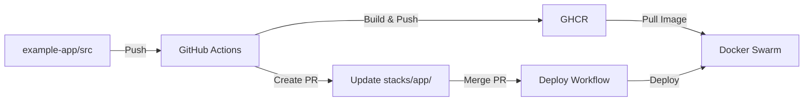

# Example App Integration

Этот документ описывает интеграцию с example-app репозиторием.

## 🔗 Структура в монорепозитории

**example-app/** (в этом репозитории) → **stacks/app/** (в этом репозитории)



## 📦 Настройка GHCR доступа

### Для публичных образов

Если образ публичный, ничего настраивать не нужно. Docker автоматически подтянет образ из GHCR.

### Для приватных образов

1. **Создайте Personal Access Token** с правами `read:packages`
2. **Добавьте в Docker Swarm credentials:**

```bash
# На сервере с Docker Swarm
echo "YOUR_PAT_TOKEN" | docker login ghcr.io -u USERNAME --password-stdin

# Или через Docker config
cat > ~/.docker/config.json << EOF
{
  "auths": {
    "ghcr.io": {
      "auth": "BASE64_OF_USERNAME:TOKEN"
    }
  }
}
EOF
```

3. **Обновите docker-compose.yml:**

```yaml
services:
  nginx:
    image: ghcr.io/username/example-app:latest
    deploy:
      # ...
```

## 🔄 Автоматическое обновление

### Как это работает

1. **Разработчик** изменяет `example-app/src/index.html`
2. **Push** в `main` ветку
3. **GitHub Actions** из `example-app/.github/workflows/`:
   - Собирает Docker образ
   - Пушит в GHCR с новой версией (v1.0.X)
   - Создаёт PR в этом репозитории
4. **Review и Merge PR** вручную
5. **GitHub Actions** в этом репозитории:
   - Обнаруживает изменение в `stacks/app/`
   - Деплоит обновлённый стек на сервер

### Структура PR

PR от example-app будет содержать:
- Обновление образа в `stacks/app/docker-compose.yml`
- Информацию о версии
- Ссылку на исходный коммит

## 🚀 Ручное обновление версии

Если нужно обновить версию вручную через веб-редактор:

1. Откройте `stacks/app/docker-compose.yml` на GitHub
2. Найдите строку:
   ```yaml
   image: ghcr.io/username/example-app:v1.0.5
   ```
3. Измените на нужную версию:
   ```yaml
   image: ghcr.io/username/example-app:v1.0.6
   ```
4. Commit → автоматический деплой!

## 📋 Доступные версии

Проверить доступные версии можно:

1. **GitHub Package:**
   - Перейдите в example-app repository
   - Packages → example-app → Tags

2. **Docker CLI:**
   ```bash
   # Список тегов (требует авторизации для приватных)
   curl -H "Authorization: Bearer $TOKEN" \
     https://ghcr.io/v2/username/example-app/tags/list
   ```

## 🔐 Настройка секретов

В этом репозитории должны быть настроены:

### GitHub Secrets

```
GHCR_TOKEN    - Personal Access Token с write:packages
```

### Настройка через gh CLI

```bash
# GHCR Token для push образов
gh secret set GHCR_TOKEN

# Проверка
gh secret list
```

**Примечание:** `DEPLOY_REPO_TOKEN` и `DEPLOY_REPO` не нужны, т.к. всё в одном репозитории!

## 🧪 Тестирование локально

```bash
# Клонируйте example-app
git clone https://github.com/username/example-app.git
## 🧪 Тестирование локально

```bash
# Перейдите в директорию example-app
cd example-app

# Соберите образ локально
docker build -t example-app:test .

# Запустите локально
docker run -p 8080:80 example-app:test

# Откройте http://localhost:8080
```
1. Откройте `stacks/app/docker-compose.yml`
2. Измените версию на предыдущую:
   ```yaml
   image: ghcr.io/username/example-app:v1.0.4  # Было v1.0.5
   ```
3. Commit → откат на предыдущую версию!

Или через реверт PR:
1. GitHub → Pull requests → Closed
2. Найдите PR с обновлением
3. Revert → создаст новый PR с откатом

## 📊 Мониторинг деплоев

### GitHub Actions

1. **Example App:** Actions → Build and Deploy
2. **This Repo:** Actions → Deploy to Docker Swarm

### На сервере

```bash
# Проверить какая версия запущена
docker service ps app_nginx --format "{{.Image}}"

# Логи
docker service logs -f app_nginx

# История обновлений
docker service ps app_nginx --no-trunc
```

## 🎯 Best Practices

1. **Всегда review PR** перед merge
2. **Используйте теги** для мажорных версий:
   ```bash
   cd example-app
   git tag v2.0.0
   git push --tags
   ```
3. **Тестируйте локально** перед push
4. **Мониторьте логи** после деплоя
5. **Держите образы публичными** для упрощения или настройте credentials

## 🐛 Troubleshooting

**Проблема:** Docker не может подтянуть образ
```bash
# Проверьте авторизацию
docker login ghcr.io

# Проверьте что образ существует
docker pull ghcr.io/username/example-app:latest
```

**Проблема:** PR не создаётся автоматически
**Проблема:** PR не создаётся автоматически
```bash
# Проверьте секрет:
gh secret list

# Должен быть: GHCR_TOKEN

# Проверьте что workflow файл на месте:
ls -la example-app/.github/workflows/build-and-deploy.yml
```
**Проблема:** Старая версия после merge PR
```bash
# Проверьте логи GitHub Actions
# Проверьте что изменения применились:
docker service inspect app_nginx --format='{{.Spec.TaskTemplate.ContainerSpec.Image}}'
```
