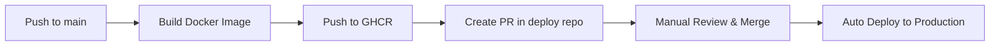

# Example App Repository

Пример приложения для демонстрации GitOps workflow с автоматической сборкой и деплоем.

## 📁 Структура

```
.
├── .github/
│   └── workflows/
│       └── build-and-deploy.yml  # Сборка образа и обновление в основном репо
├── src/
│   └── index.html                # Контент приложения
├── Dockerfile                    # Сборка образа
└── README.md
```

## 🚀 Как это работает

1. **Изменяете контент** в `src/index.html`
2. **Commit и push** в `main`
3. **GitHub Actions автоматически:**
   - Собирает Docker образ
   - Пушит в GitHub Container Registry
   - Создаёт PR в основной репозиторий с новой версией
4. **Merge PR** → автоматический деплой в production

## 🔧 Настройка

### 1. Создайте Personal Access Token (Classic)

1. GitHub → Settings → Developer settings → Personal access tokens → Tokens (classic)
2. Generate new token (classic)
3. Выберите права:
   - ✅ `repo` (full control)
   - ✅ `write:packages` (для GHCR)
4. Скопируйте токен

### 2. Добавьте секреты в репозиторий

Settings → Secrets and variables → Actions → New repository secret:

- `GHCR_TOKEN` - ваш Personal Access Token (для пуша в GHCR)
- `DEPLOY_REPO_TOKEN` - тот же токен (для создания PR в основном репо)
- `DEPLOY_REPO` - формат: `username/repo-example` (основной репозиторий)

### 3. Настройте GHCR (опционально)

Если пакет приватный, настройте доступ:
```bash
echo $GHCR_TOKEN | docker login ghcr.io -u USERNAME --password-stdin
```

## 📦 Использование

### Изменение контента

```bash
# Отредактируйте src/index.html
vim src/index.html

# Commit и push
git add src/index.html
git commit -m "Update homepage content"
git push

# GitHub Actions автоматически:
# 1. Соберёт новый образ с тегом (например, v1.0.5)
# 2. Запушит в ghcr.io
# 3. Создаст PR в основном репозитории
```

### Версионирование

Версия определяется автоматически на основе количества коммитов:
- `v1.0.X` где X - количество коммитов

Или можно использовать теги:
```bash
git tag v2.0.0
git push --tags
```

## 🔗 Интеграция с основным репозиторием

Workflow создаёт PR в основном репозитории, изменяя:
```yaml
# stacks/app/docker-compose.yml
nginx:
  image: ghcr.io/username/example-app:v1.0.5  # Обновляется автоматически
```

## 🐳 Локальная разработка

```bash
# Сборка образа
docker build -t example-app .

# Запуск локально
docker run -p 8080:80 example-app

# Открыть http://localhost:8080
```

## 📝 Структура Dockerfile

- Базовый образ: `nginx:alpine`
- Копирует `src/index.html` в `/usr/share/nginx/html/`
- Экспонирует порт 80

## 🔄 CI/CD Pipeline



## 🛠 Troubleshooting

**Проблема:** Workflow не может создать PR
```bash
# Проверьте токен DEPLOY_REPO_TOKEN
# Должны быть права: repo, write:packages
```

**Проблема:** Образ не пушится в GHCR
```bash
# Проверьте токен GHCR_TOKEN
# Сделайте пакет публичным: GitHub → Packages → Package settings → Change visibility
```

**Проблема:** PR не создаётся автоматически
```bash
# Проверьте DEPLOY_REPO - должен быть формат: username/repo-name
# Проверьте что бот имеет доступ к репозиторию
```
